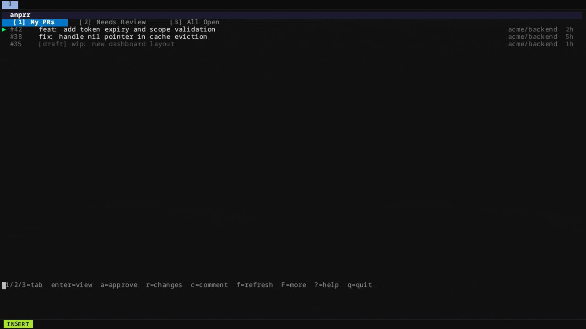

# anprr

<p align="center">
  
</p>

A terminal UI for reviewing GitHub pull requests — without leaving the terminal.

<p align="center">
  
</p>

```
┌─ anprr ─────────────────────────────────────────────────────┐
│ [1] My PRs      [2] Needs Review      [3] All Open          │
├─────────────────────────────────────────────────────────────┤
│ ▶ #42  fix auth bug          myorg/backend   2h  ●          │
│   #38  [bot] bump toml       myorg/backend   1d  ●          │
│   #91  [draft] wip feature   myorg/frontend  3h  ○          │
├─────────────────────────────────────────────────────────────┤
│ 1/2/3=tab  enter=view  a=approve  r=changes  c=comment      │
│ f=refresh  ?=help  q=quit                                   │
└─────────────────────────────────────────────────────────────┘
```

## Features

- **3 tabs** — My PRs / Needs Review / All Open
- **Precise "Needs Review"** — uses GitHub Search API (`review-requested:@me`) + re-review detection (new commits after your last review). Bot PRs (Dependabot, Renovate) appear when still pending.
- **Colored unified and split diff** (`s` to toggle) with syntax highlighting per language (on by default, disable with `--no-syntax`)
- **Inline review comments** — navigate lines with `n`, add comments per line, send all together with the review
- **Approve confirmation** — `a` shows a prompt: approve now or add a comment first
- **Merge from TUI** — `m` selects squash / merge commit / rebase without leaving the terminal
- **Multi-line comment box** — `r` / `c` open a resizable textarea (`ctrl+d` to submit, `enter` for new line)
- **Direct GitHub API** — no dependency on `gh` CLI

## Install

```bash
go install github.com/roramirez/anprr@latest
```

Or build from source:

```bash
git clone https://github.com/roramirez/anprr
cd anprr
go build -o anprr .
mv anprr ~/.local/bin/
```

## Setup

```bash
# 1. Save your GitHub Personal Access Token (scopes: repo, read:user)
anprr login --token ghp_xxxx

# 2. Add repos to track
anprr repos add myorg/backend
anprr repos add myorg/frontend

# 3. Launch
anprr
```

Token priority: `--token` flag > `GITHUB_TOKEN` env > `~/.config/anprr/config.toml`

### Config file

`~/.config/anprr/config.toml`

```toml
token  = "ghp_xxxx"
repos  = ["myorg/backend", "myorg/frontend"]
no-syntax = false   # set to true to disable syntax highlighting
```

## Key bindings

### PR List

| Key | Action |
|-----|--------|
| `1` / `2` / `3` | Switch tab (My PRs / Needs Review / All Open) |
| `j` / `↓` | Move down |
| `k` / `↑` | Move up |
| `enter` | Open PR detail |
| `a` | Approve PR |
| `r` | Request changes |
| `c` | Post comment |
| `f` | Refresh  |
| `F` | Load more PRs |
| `?` | Toggle help |
| `q` | Quit |

### PR Detail

| Key | Action |
|-----|--------|
| `j` / `k` | Scroll diff |
| `pgdn` / `pgup` | Page scroll |
| `s` | Toggle unified / split diff |
| `n` | Enter line-select mode (inline comments) |
| `a` | Approve PR (confirm prompt) |
| `m` | Merge PR (squash / merge commit / rebase) |
| `r` | Request changes |
| `c` | Post comment |
| `w` | Open PR in browser |
| `b` / `esc` | Back to list |
| `f` | Refresh diff |

### Comment box

| Key | Action |
|-----|--------|
| `ctrl+d` | Submit |
| `enter` | New line |
| `esc` | Cancel |

### Inline comments (line-select mode)

| Key | Action |
|-----|--------|
| `j` / `k` | Move cursor line by line |
| `n` / `enter` | Add comment on selected line |
| `s` | Toggle unified / split view |
| `esc` | Exit line-select mode |

Inline comments accumulate and are sent together when you approve or request changes.

## Requirements

- Go 1.19+
- GitHub Personal Access Token with `repo` and `read:user` scopes
